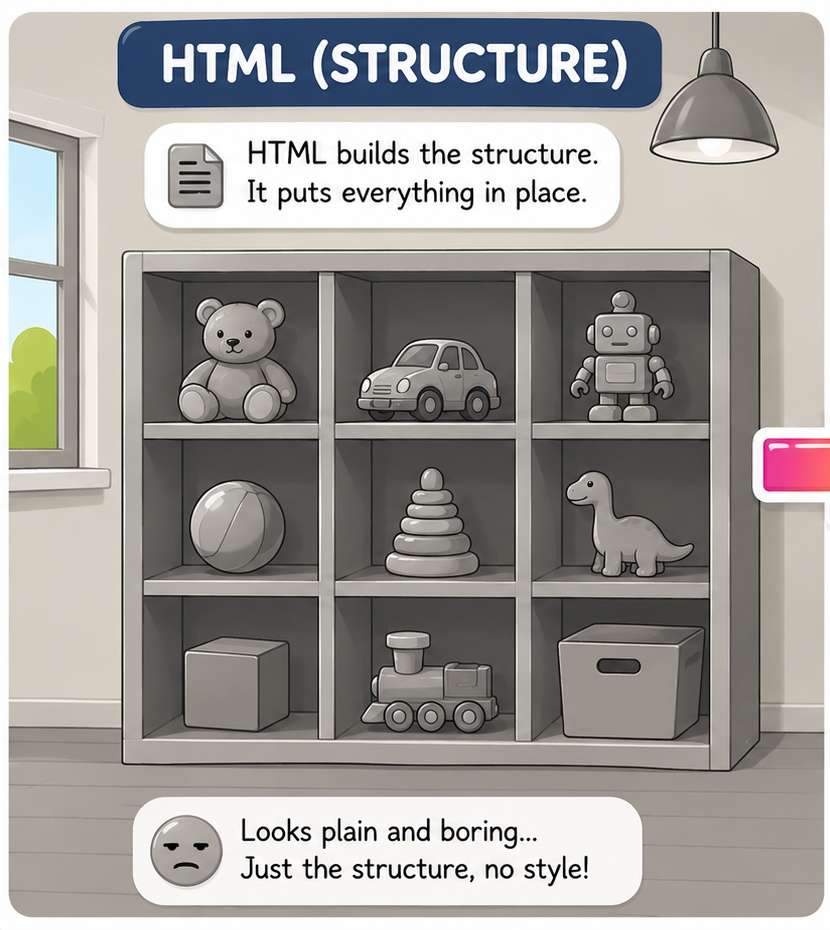
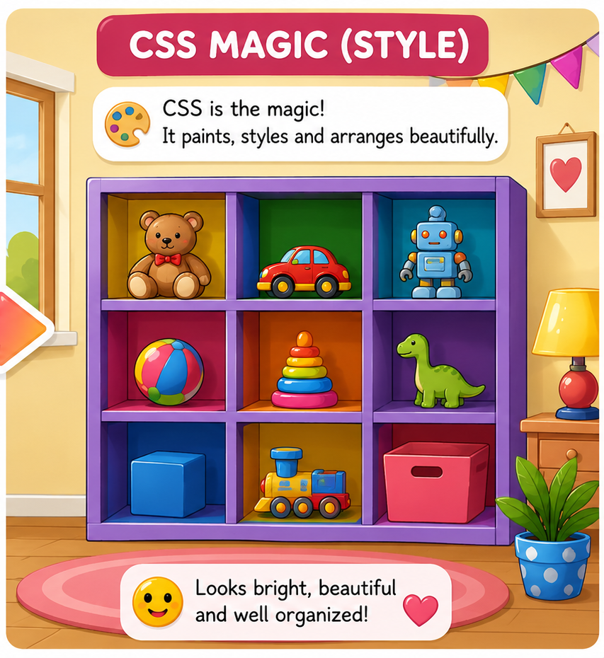
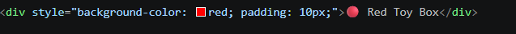
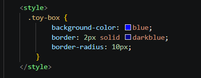
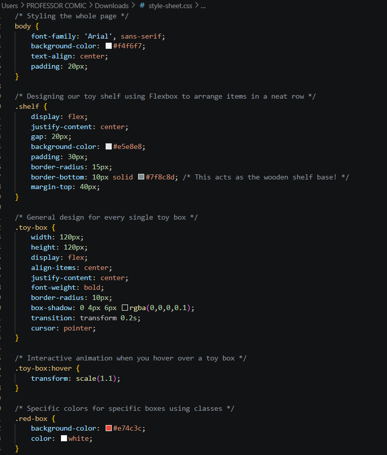
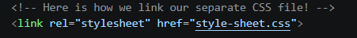
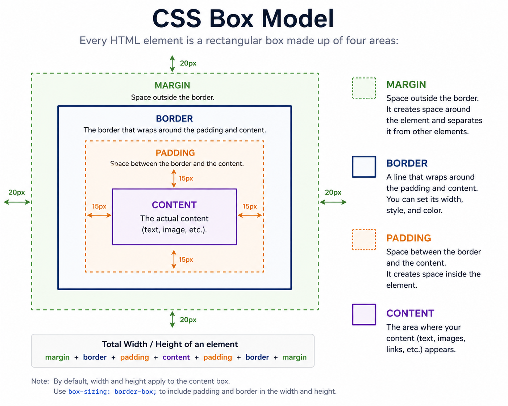
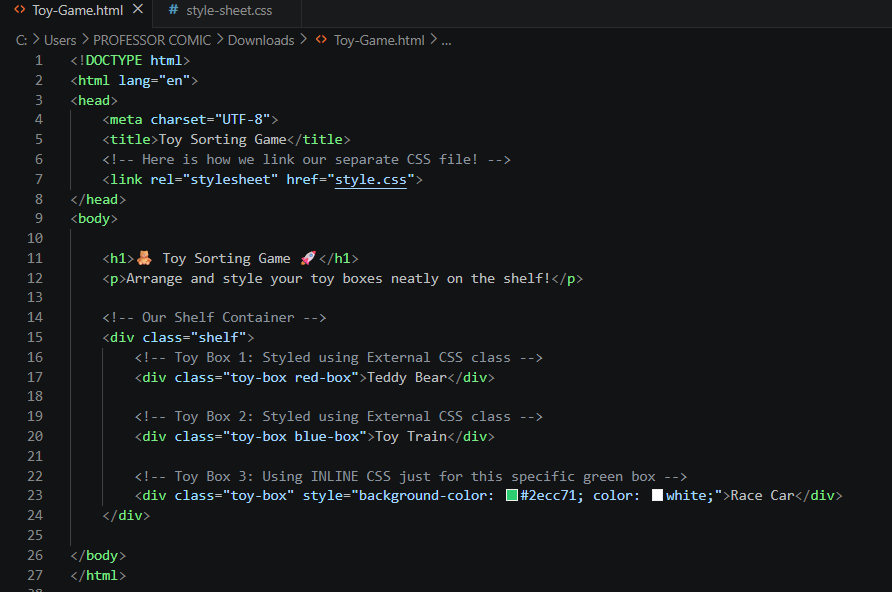
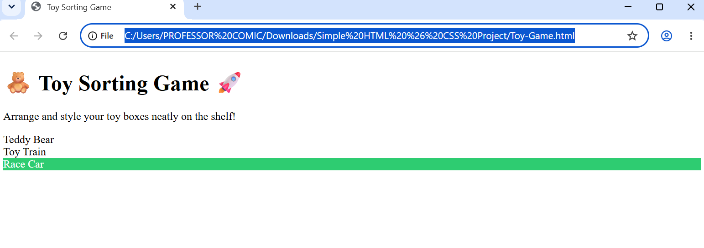
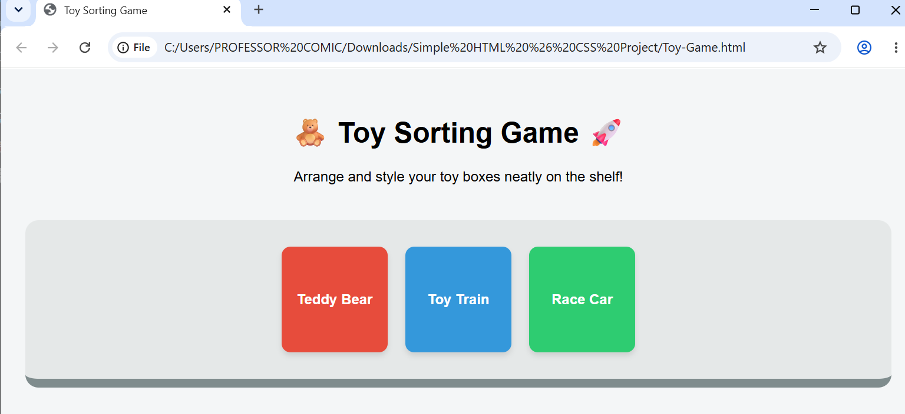

# Simple-HTML-CSS-Project


# 🎨 The Magic of CSS: Creating a Toy Organizing Game

## Introduction

Imagine you have built a room with shelves using HTML. HTML creates the structure of the room—it builds the walls, places the shelves, and provides a place for everything, as shown below.



But right now, all the toys are plain, gray, and boring.

They look a little awkward, right?

To make them attractive and beautiful, we need to add colors, styles, and organization.

In the real world, we might use paint or watercolors. In web development, we use something called **CSS**!

**CSS** stands for **Cascading Style Sheets**.

Think of CSS as a magical paintbrush and organizer for your website. It tells the browser exactly how things should look—such as what color a button should be, how large text should appear, or how toys should be arranged neatly on a shelf.



---

# ✨ The 3 Magical Ways to Use CSS

There are three different ways to style your HTML using CSS.

## 1. Inline CSS (The Quick Paintbrush)

This is like painting a single toy while holding it in your hand.

You write the style directly inside the HTML tag.

It's quick and easy, but if you have 100 toys to paint, doing them one by one would take a lot of time.

### Example



---

## 2. Internal CSS (The Room Rules)

This is like writing a rule on the wall of the room:

> "All toy boxes in this room must be blue!"

You write these styles inside a `<style>` tag within your HTML document.

**Note:** The `<style>` tag should always be placed inside the `<head>` section of the HTML document.

### Example



---

## 3. External CSS (The Master Blueprint — Recommended!)

This is the cleanest and most professional method.

You write all your styling rules in a separate file called **style.css** and then connect it to your HTML file.

This approach keeps your code organized and easier to maintain.

### Example



---

# 🔗 How to Link an External CSS File

To connect your `style.css` file to your `index.html` file, place a `<link>` element inside the `<head>` section of your HTML document.

### Example



---

# 📦 Understanding the CSS Box Model

Before we start styling our Toy Sorting Game, we need to understand one of the most important concepts in CSS: the **CSS Box Model**.

Think of every HTML element as a toy packed inside a box.

Whether it's a heading, paragraph, button, image, or card, the browser treats every element as a rectangular box made up of four layers.



---

## 1. Content

The **Content** area is the actual information inside the element.

Examples include:

- Text
- Images
- Videos
- Links
- Buttons

Think of it as the toy itself inside the box.

---

## 2. Padding

**Padding** is the space between the content and the border.

Imagine placing a toy inside a gift box. You add protective wrapping around it so it doesn't touch the edges.

That's exactly what padding does.

More padding creates more breathing room inside the element.

---

## 3. Border

The **Border** is the line that wraps around the padding and content.

It acts like the walls of the toy box.

You can customize:

- Border Width
- Border Style
- Border Color

Borders help define the boundaries of an element.

---

## 4. Margin

**Margin** is the space outside the border.

Think of it as the empty space between one toy box and another on a shelf.

Margins help prevent elements from appearing crowded and improve layout organization.

---

# 🎁 The Toy Box Analogy

Imagine a toy packed inside a decorated gift box:

| Box Model Part | Toy Analogy |
|--------------|------------|
| Content | The toy itself |
| Padding | Protective wrapping around the toy |
| Border | The walls of the gift box |
| Margin | Space between gift boxes |

This is exactly how browsers organize elements on a webpage.

---

# ⭐ Why Is the Box Model Important?

Understanding the CSS Box Model helps you:

- Create proper spacing between elements
- Build clean and professional layouts
- Prevent content from looking crowded
- Control the size and position of webpage elements

Almost every CSS design—from buttons and cards to navigation bars and entire websites—relies on the Box Model.

---

# 🧠 Quick Memory Trick

Remember the order from the inside outward:

```text
Content → Padding → Border → Margin
```

Think of it as the layers of a toy box.

---

# 🧸 Let's Build It: The Toy Sorting Game Project

Now that we understand CSS and the Box Model, let's build a simple Toy Sorting Game.

We'll use a CSS layout technique called **Flexbox**, which works like a smart shelf organizer that arranges toys neatly and efficiently.

---

## Step 1: Create the HTML File

**File:** `Toy-Game.html`
## View the Project

[Open the HTML File](./Toy-Game.html)



---

## Step 2: Create the CSS File

**File:** `style-sheet.css`

[Open the HTML File](./style-sheet.css)


---

# 🎯 Results

## Before Styling



---

## After Styling



---

# 📚 Learn More & Practice

Want to continue improving your CSS skills?

Practice CSS selectors, layouts, colors, and styling techniques through interactive tutorials on:

- [W3Schools](https://www.w3schools.com/)
- [MDN Web Docs](https://developer.mozilla.org/)
- [freeCodeCamp](https://www.freecodecamp.org/)

The more you practice, the more creative and beautiful your websites will become!

---

## 🎉 Conclusion

HTML builds the room.

CSS decorates and organizes it.

Together, they transform a plain structure into a beautiful and interactive website.

Happy Coding! 🚀